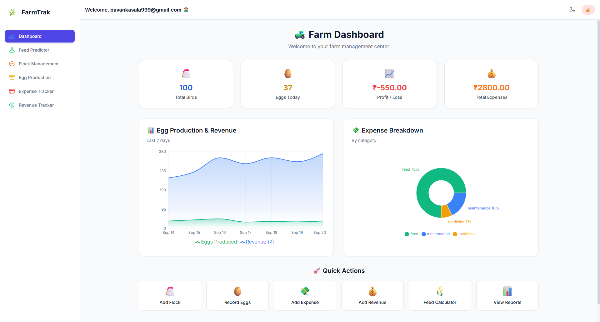
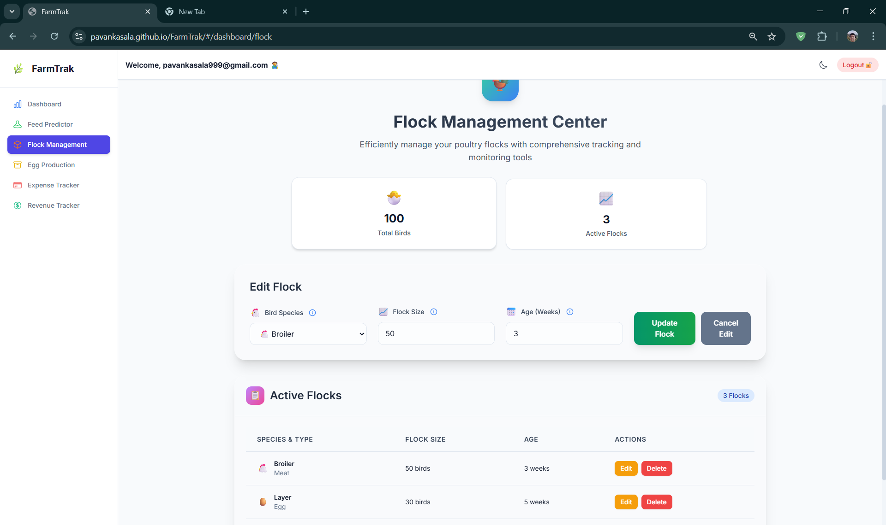
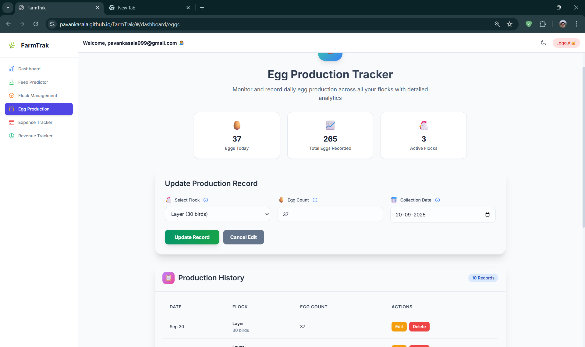

# 🌾 FarmTrak - Poultry Farm Management


FarmTrak is a comprehensive web application designed to help poultry farmers manage their operations efficiently. It provides a centralized platform for tracking flocks, recording financial data, monitoring egg production, and analyzing key farm metrics to optimize performance.

---

## 🚀 Live Features

* 🔒 **Secure Authentication**: Users can securely sign in or sign up using email verification (OTP) or Google Single Sign-On (SSO).  
* 📊 **Data-rich Dashboard**: A central hub provides a visual overview of key metrics such as total birds, daily egg production, and profit/loss.  
* 🦉 **Flock Management**: Easily add, edit, and delete flock records, including species, size, age, and start date.  
* 🥚 **Egg Production Tracker**: Record daily egg counts for specific flocks to monitor production trends over time.  
* 💳 **Financial Tracking**: Log and categorize all farm expenses (e.g., feed, medicine) and revenue (e.g., egg sales, flock sales).  
* 📦 **Feed Calculator**: An interactive tool to calculate and predict a flock's daily feed consumption per bird based on a given duration.  
* 🌄 **Responsive UI & Dark Mode**: The modern interface adapts seamlessly to different screen sizes and includes a user-friendly dark mode.  

---

## 💻 Tech Stack

* **Backend**: `Java` with `Spring Boot`  
* **Database**: `PostgreSQL`  
* **Frontend**: `React` with `Vite`  
* **Styling**: `Tailwind CSS` with `Framer Motion` for animations  
* **Charting**: `Recharts` for data visualization  
* **Deployment**: `Render` for the backend API and `GitHub Pages` for the frontend  

---

## 🛠️ Setup

### Prerequisites
- Java Development Kit (JDK) 17+  
- Maven 3.6+  
- Node.js 14+ and npm  
- A PostgreSQL database  
- Google Cloud project for OAuth credentials  
- Email service (e.g., Gmail with an app password)  

### 1. Backend

1. **Clone the repository**:
    ```sh
    git clone https://github.com/Pavankasala/FarmTrak.git
    cd FarmTrak/Backend
    ```

2. **Configure environment variables**:
    ```properties
    spring.datasource.url=${JDBC_DATABASE_URL}
    spring.datasource.username=${JDBC_DATABASE_USERNAME}
    spring.datasource.password=${JDBC_DATABASE_PASSWORD}
    spring.mail.username=${MAIL_USERNAME}
    spring.mail.password=${MAIL_APP_PASSWORD}
    ```

3. **Build and run**:
    ```sh
    ./mvnw clean install -DskipTests
    java -jar target/*.jar
    ```

### 2. Frontend

1. **Navigate to the frontend directory**:
    ```sh
    cd ../Frontend
    ```

2. **Install dependencies**:
    ```sh
    npm install
    ```

3. **Run in development mode**:
    ```sh
    npm run dev
    ```

---

## 📁 File Structure
    FarmTrak/
    ├─ Backend/
    │ ├─ src/
    │ │ ├─ main/
    │ │ │ ├─ java/com/farmtrak/
    │ │ │ │ ├─ controller/
    │ │ │ │ ├─ model/
    │ │ │ │ ├─ repository/
    │ │ │ │ ├─ service/
    │ │ │ │ └─ FarmTrakApplication.java
    │ │ │ └─ resources/
    │ │ │ └─ application.properties
    │ │ └─ test/
    │ ├─ pom.xml
    │ └─ mvnw / mvnw.cmd
    ├─ Frontend/
    │ ├─ src/
    │ │ ├─ components/
    │ │ ├─ pages/
    │ │ ├─ utils/
    │ │ └─ App.jsx
    │ ├─ public/
    │ └─ package.json
    └─ README.md

---

## 🖼️ Screenshots

**Dashboard**  


**Flock Management**  


**Egg Production Tracker**  


**Expense Tracker & Feed Calculator**  


---

## 🌐 Live Demo

- **Frontend**: [https://pavankasala.github.io](https://pavankasala.github.io)  
- **Backend API**: [https://farmtrak.onrender.com](https://farmtrak.onrender.com)  

---

## 🏆 Code Quality

A repository badge with an **"APlus" rating from CodeFactor.io** means the code in this repository has been automatically reviewed and received the highest possible grade for quality.  
CodeFactor analyzes code for complexity, style violations, and potential bugs, ensuring adherence to best practices.

---

## 📄 License

This project is licensed under the **MIT License**. See `LICENSE` for details.
